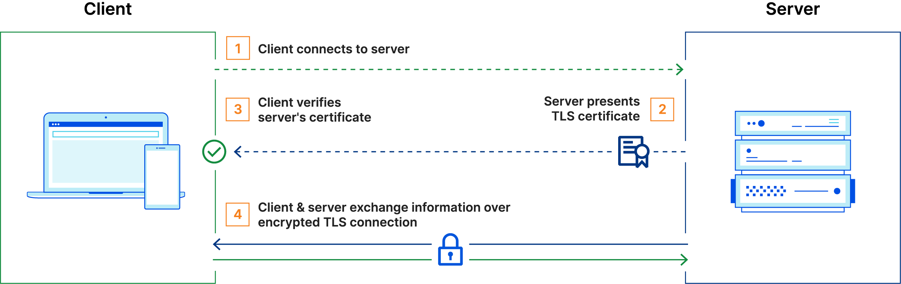
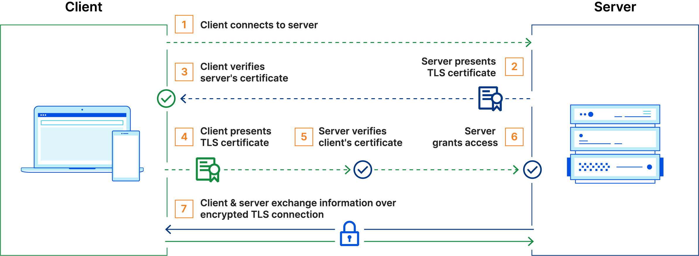

# hello-tls-server

This is a simple example to learn how to use TLS/mTLS with Java and test it.

## How it works

1. [TLS by Cloudflare](https://www.cloudflare.com/learning/access-management/what-is-mutual-tls/)



2. [mTLS by Cloudflare](https://www.cloudflare.com/learning/access-management/what-is-mutual-tls/)



## How to create certificates and test it

### [Generate certificates](https://medium.com/weekly-webtips/how-to-generate-keys-for-mutual-tls-authentication-a90f53bcec64)

1. CA (Certificate Authority) with private key:

```bash
openssl req -new -x509 -days 9999 -keyout ca-key.pem -out ca-crt.pem
```

- You’ll be asked to insert a CA password. Input a preferred password that you’ll remember.
- You’ll be prompted to specify a CA Common Name. Insert that you prefer like root.localhost or ca.localhost.

2. Server certificate with private key signed by the CA:

```bash
openssl genrsa -out server-key.pem 4096
```

- You’ll be asked to insert a server password. Input a preferred password that you’ll remember.

Now, create CSR (Certificate Signing Request) for the server to be signed by the CA:
```bash
openssl req -new -key server-key.pem -out server-csr.pem
```

- You’ll be prompted to specify a CA Common Name. Insert that you prefer like localhost or server.localhost.
- Optionally insert a challenge password

> The client will need to verify the Common Name, so make sure you have a valid DNS name for this.

Now sign the server certificate with the CA:
```bash
openssl x509 -req -days 9999 -in server-csr.pem -CA ca-crt.pem -CAkey ca-key.pem -CAcreateserial -out server-crt.pem
```

Checks if the server certificate is ok:
```bash
openssl verify -CAfile ca-crt.pem server-crt.pem
```

3. (mTLS): Client certificate with private key signed by the CA:

```bash
openssl genrsa -out client-key.pem 4096
```

Now, generate CSR (Certificate Signing Request) for the client to be signed by the CA:
```bash
openssl req -new -key client-key.pem -out client-csr.pem
```

- You’ll be prompted to specify a CA Common Name. Insert that you prefer like client.localhost. The server should not verify this, since it should not do a reverse DNS lookup.
- Optionally insert a challenge password

Now sign the client certificate with the CA:
```bash
openssl x509 -req -days 9999 -in client-csr.pem -CA ca-crt.pem -CAkey ca-key.pem -CAcreateserial -out client-crt.pem
```

Checks if the client certificate is ok:
```bash
openssl verify -CAfile ca-crt.pem client-crt.pem
```

Convert `.pem` client certificate and private key to `.p12` (Keystore doesn't support `.pem`, only: `.jks`, `.p12`, `.pfx`):
```bash
openssl pkcs12 -export -out client-keystore.p12 -inkey client-key.pem -in client-crt.pem
```

### Tests

1. Clone project and build it:

```bash
./mvnw clean package
```

2. Execute the following command to run the server:

```bash
java -Dmtls=<true|false> -Dserver-crt=<path> -Dserver-key=<path> -Dserver-secret=<string> -Dca-crt=<path> -jar target/hello-tls-mlts.jar
```

- `mtls`: Enable mTLS
- `server-crt`: Path to the server certificate
- `server-key`: Path to the server private key
- `server-secret`: Password for the server private key
- `ca-crt`: Required for mTLS. Path to the CA certificate

3. With server running, execute the following command to test your client certificate:

```bash
./mvnw -Dtest=ClientIT -DargLine="-Dkeystore=<base64> -Dtruststore=<base64> -Dkeystore_password=<string> -Dtruststore_password" test
```

- `keystore`: Base64 encoded client certificate and private key
- `truststore`: Base64 encoded CA certificate
- `keystore_password`: Password for the client private key
- `truststore_password`: Password for the CA certificate